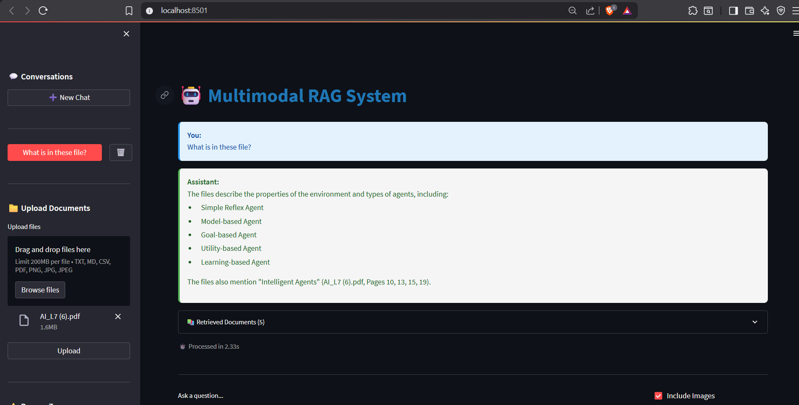

# DracAI-Multimodal-RAG-System
## A Multimodal Retrieval-Augmented Generation (RAG) system that intelligently processes and queries across different data modalities:

- 📄 Plain text documents (TXT, MD, CSV)
- 🖼️ Images (PNG, JPG, JPEG, GIF, BMP)
- 📑 PDFs (with text, images, or mixed content)

## Key Capabilities
- ✅ Cross-modal search: Ask about images using text queries
- ✅ Context-aware responses: Maintains conversation history
- ✅ Source attribution: Every answer cites its sources
- ✅ Flexible queries: Handles specific questions to vague explorations
- ✅ Production-ready: Containerized, scalable, with observability

```
┌──────────────────────────────────────────────────────────────┐
│                        User Interface                         │
│                      (Streamlit Frontend)                     │
└───────────────────────────┬──────────────────────────────────┘
                            │ HTTP REST API
                            ▼
┌──────────────────────────────────────────────────────────────┐
│                      FastAPI Backend                          │
├──────────────────────────────────────────────────────────────┤
│  ┌─────────────┐  ┌──────────────┐  ┌──────────────────┐   │
│  │ Document    │  │ Query        │  │ Vector Store     │   │
│  │ Processor   │  │ Service      │  │ Service          │   │
│  └─────────────┘  └──────────────┘  └──────────────────┘   │
└───────────────────────────┬──────────────────────────────────┘
                            │
        ┌───────────────────┼───────────────────┐
        ▼                   ▼                   ▼
┌──────────────┐   ┌──────────────┐   ┌──────────────┐
│  ChromaDB    │   │ CLIP Model   │   │ Gemini LLM   │
│ Vector Store │   │ Embeddings   │   │ (Google AI)  │
└──────────────┘   └──────────────┘   └──────────────┘
```

## Setup Instructions
```
uv init
uv venv
.venv\Scripts\activate
uv add -r requirements.txt
```

### Required
- GEMINI_API_KEY=your_gemini_api_key_here

### Optional - LangSmith Tracing
- LANGCHAIN_TRACING_V2=true
- LANGCHAIN_ENDPOINT=https://api.smith.langchain.com
- LANGCHAIN_API_KEY=your_langsmith_key
- LANGCHAIN_PROJECT=multimodal-rag

### cd backend
- python -m uvicorn app.main:app --reload --host 0.0.0.0 --port 8000

### cd frontend
- streamlit run app.py --server.port 8501


## Detailed Steps
1. File Validation

- Check file size (max 10MB)
- Verify supported format
- Validate file integrity

2. Document Processing

- Text files: Read content directly
- Images: Convert to base64, extract with CLIP
- PDFs: Extract text + embedded images separately

3. Chunking Strategy

- Text: 1000 characters with 200 character overlap
- Images: Single chunk per image
- PDFs: Page-by-page processing

4. Embedding Generation

- Text: CLIP text encoder (512-dimensional)
- Images: CLIP image encoder (512-dimensional)
- Both use same embedding space for cross-modal search

5. Storage

- Chunks stored in ChromaDB with metadata
- Document ID generated from file hash
- Metadata includes: filename, type, timestamp, page numbers


# Some Result
